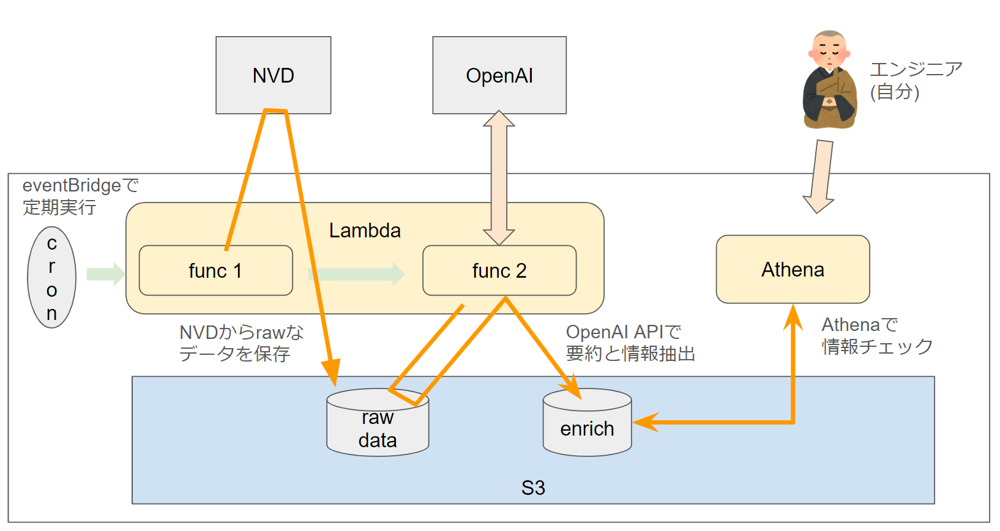
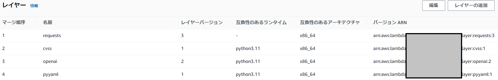
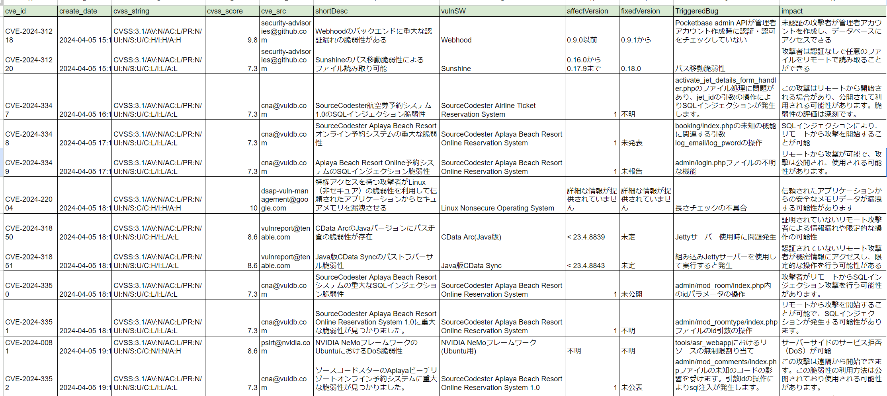

# このツールの使い方など

個人的な調査のために作っていますが、もし使う方がいれば是非！ということでざっくりどんなものかを説明します。  

## 目的

[NVD](https://nvd.nist.gov/)の脆弱性情報から実行時点から昨日に更新された脆弱性を取得し、その内容をOpenAIで可読性を高めたツールです。  

## 使い方

全体として以下のようなイメージで動作・利用することを想定しています。(AWS利用想定)  


OpenAIでわかりやすくした結果は、CSVで保存されています。  
そのためExcelなどで見ることも可能ですが、Athenaの利用も可能になっています。(本リポジトリにあるathena_query_templatesはAthenaでデータベース作成や検索をするサンプルです)

CSVでの保存を行っていますので、その先は好きに分析・活用してください。

### 必要なもの

このツールはNVDから取得したデータのみ保存するモードと、OpenAIのAPIで必要情報の抽出も行わせるモードがあります。  
設定ファイルにある、以下のオプションで切り替え可能です。  
```yaml
openai_parse:
  enable: true # falseにすればOpenAIとのアクセスはしない
```

### 初期設定

以下の様に使います。

- ダウンロードし必要ライブラリのインストール
```bash
git clone https://github.com/proshiba/vulnchecker
cd vulnchecker
pip install -r requirements
```

私はLambda上で利用していますが、その場合はLayerとして以下の様に必要ライブラリを追加してください。  



- 設定ファイル(config内のconfig.yaml_sample)をリネームしS3バケットなどの設定を実施(以下にあるyour_bucket_name_write_hereをバケット名に入れ替え)
  - 必要に応じて、その他の設定もカスタマイズしてください。

```yaml
storage:
  type: s3
  s3:
    bucket: your_bucket_name_write_here
```

- logger用の設定ファイルもリネーム
  - 必要に応じて、その他の設定もカスタマイズしてください。

- OpenAIのAPI利用準備を行い、APIキーを取得
- 取得したAPIキーを環境変数(`OPENAI_API_KEY`)として設定

これで準備は完了です。  
main.pyを実行すれば動作します。lambdaであれば実行すれば`lambda_function.py`経由で実行されます。

#### AWS以外で使いたいんだけど？

現状、boto3を使う上での認証設定などは組み込んでません。その辺りは追加開発が必要です。  
参考: https://qiita.com/tsukamoto/items/00ec8ef7e9a4ce4fb0e9

### Appendix

#### アウトプット

ざっくり以下のような情報が取得されます。これは2024/4/6のデータをベースにしています。  


**disclaimer: あくまでChatGPTベースのデータであり間違いがあることは想定しておいてください**

#### どのくらいお金がかかるの？

##### AWS費用
このツールを使った場合、AWSでは以下の点で費用が掛かる可能性があります。  

- S3
  - リクエスト数
  - 保存データ数
- Lambda
- Athena

しかし、大したデータ量ではありませんので、これはそれほどお金はかからないと期待しています。  

##### OpenAI費用

トークン数によって変わります。またトークン数はざっくり文章の長さに比例します。  
このツールでは脆弱性の説明文をparseさせていますが、以下の設定でその長さを制限しています。  
Note: デフォルトは1000です

- `config.yaml`内の設定
```yaml
openai_parse:
  omit_property:
    max_length: 1000
    use_which: both # head, tail, both
```

`use_which`という設定がありますが、これは文章を省略する際に、どの個所を残すかを決めています。
- head: 先頭を残します。（後略の形）
- tail: 末尾を残します。（前略の形）
- both: 先頭と末尾の両方を残します。（中略の形）

この前提で、2024年4月6日のデータを処理した場合の費用が以下です。

- 対象脆弱整数: 23
- 金額: $1.18

1日でこれですから、月額では`$35.4`です。  
実際にはもっとデータ量の多い日がある可能性などを考慮しますと、`$45`ぐらいは見ておいた方がいいかもです。

